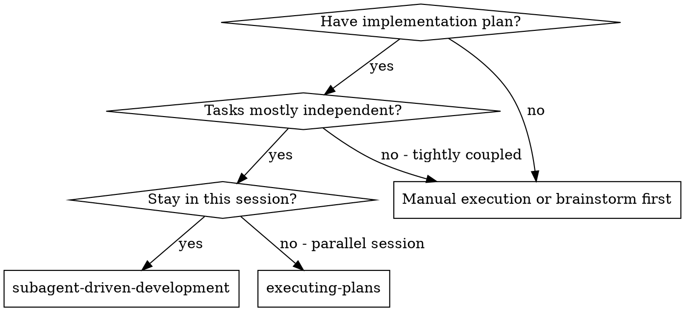

# Subagent-Driven Development

Execute a written plan by dispatching focused subagents per task. In this repository, review depth should match task risk rather than forcing the heaviest review stack onto every small task.

**Why subagents:** You delegate tasks to specialized agents with isolated context. By precisely crafting their instructions and context, you ensure they stay focused and succeed at their task. They should never inherit your session's context or history — you construct exactly what they need. This also preserves your own context for coordination work.

**Core principle:** Fresh subagent per task + proportional review depth = high quality without unnecessary process.

## When to Use



**vs. Executing Plans (parallel session):**
- Same session (no context switch)
- Fresh subagent per task (no context pollution)
- Review after each task when the task risk justifies it
- Faster iteration (no human-in-loop between tasks)

## The Process

1. Read the plan once, extract the task text and required context, then create TodoWrite entries.
2. For each task, choose review depth before dispatch:
   - Narrow and low-risk task: implementer + one targeted review
   - Spec-sensitive, risky, or core task: implementer + spec review + code quality review
3. Dispatch the implementer subagent with the exact task text and local context.
4. If the implementer asks for missing context, answer first and re-dispatch.
5. Have the implementer verify the task result. Do not require a commit unless the task or user explicitly calls for one.
6. Run the review path chosen for that task. If a reviewer finds issues, send them back to the same implementer and re-run only the needed review.
7. Mark the task complete only after the chosen verification and review steps are satisfied.
8. After all tasks finish, run repository-level verification. Use `requesting-code-review` only for major or high-risk diffs, and use `finishing-a-development-branch` only if the user wants integration handling.

## Review Depth Selection

Choose the lightest review stack that still protects the change:

- **Implementer only:** only for tiny, mechanical, single-file tasks where the controller can cheaply inspect the diff.
- **Implementer + spec review:** when scope control matters more than design quality, such as contract or field-level changes.
- **Implementer + code quality review:** when the task is straightforward but maintainability or edge cases matter.
- **Implementer + spec review + code quality review:** for core flows, cross-frontend-backend work, permission/menu/App context changes, or anything risky enough that both checks are justified.

Do not blindly run the full two-stage review stack for every tiny task just because subagents are involved.

## Model Selection

Use the least powerful model that can handle each role to conserve cost and increase speed.

**Repository-local default policy (Codex):**
- **Implementer subagent**: start with `gpt-5.4-mini` and `low` reasoning for isolated, well-specified tasks.
- **Spec compliance reviewer**: start with `gpt-5.4-mini` and `low` reasoning when the scope is narrow and requirements are explicit.
- **Code quality reviewer**: start with `gpt-5.4` and `medium` reasoning for routine code review.
- **Final reviewer / architecture-heavy review**: use `gpt-5.4` and raise to `high` only when the diff is broad or design judgment is the point of the review.

**Mechanical implementation tasks** (isolated functions, clear specs, 1-2 files): use a fast, cheap model with low reasoning. Most implementation tasks are mechanical when the plan is well-specified.

**Integration and judgment tasks** (multi-file coordination, pattern matching, debugging): use a standard model with medium reasoning.

**Architecture, design, and critical review tasks**: use the most capable available model, but do not default to `high` or `xhigh` unless the task actually requires it.

**Task complexity signals:**
- Touches 1-2 files with a complete spec → `gpt-5.4-mini` + `low`
- Touches multiple files with integration concerns → `gpt-5.4` + `medium`
- Requires design judgment or broad codebase understanding → `gpt-5.4` + `high`

**Escalation rule:**
1. Start at the lowest tier that plausibly fits the task.
2. If the subagent reports `BLOCKED` or `DONE_WITH_CONCERNS` because of reasoning limits, move up one tier.
3. Do not start routine implementation or routine review at `xhigh`.

## Handling Implementer Status

Implementer subagents report one of four statuses. Handle each appropriately:

**DONE:** Proceed to the review path chosen for the task.

**DONE_WITH_CONCERNS:** The implementer completed the work but flagged doubts. Read the concerns before proceeding. If the concerns are about correctness or scope, address them before review. If they're observations (e.g., "this file is getting large"), note them and proceed to review.

**NEEDS_CONTEXT:** The implementer needs information that wasn't provided. Provide the missing context and re-dispatch.

**BLOCKED:** The implementer cannot complete the task. Assess the blocker:
1. If it's a context problem, provide more context and re-dispatch with the same model
2. If the task requires more reasoning, re-dispatch one tier higher rather than jumping directly to the highest setting
3. If the task is too large, break it into smaller pieces
4. If the plan itself is wrong, escalate to the human

**Never** ignore an escalation or force the same model to retry without changes. If the implementer said it's stuck, something needs to change.

## Prompt Templates

- `./implementer-prompt.md` - Dispatch implementer subagent
- `./spec-reviewer-prompt.md` - Dispatch spec compliance reviewer subagent
- `./code-quality-reviewer-prompt.md` - Dispatch code quality reviewer subagent

## Example Workflow

```
You: I'm using Subagent-Driven Development to execute this plan.

[Read plan file once: docs/superpowers/plans/feature-plan.md]
[Extract all 5 tasks with full text and context]
[Create TodoWrite with all tasks]

Task 1: Hook installation script

[Get Task 1 text and context (already extracted)]
[Dispatch implementation subagent with full task text + context]

Implementer: "Before I begin - should the hook be installed at user or system level?"

You: "User level (~/.config/superpowers/hooks/)"

Implementer: "Got it. Implementing now..."
[Later] Implementer:
  - Implemented install-hook command
  - Added tests, 5/5 passing
  - Self-review: Found I missed --force flag, added it
  - No commit requested

[Dispatch spec compliance reviewer]
Spec reviewer: ✅ Spec compliant - all requirements met, nothing extra

[Get git SHAs, dispatch code quality reviewer]
Code reviewer: Strengths: Good test coverage, clean. Issues: None. Approved.

[Mark Task 1 complete]

Task 2: Recovery modes

[Get Task 2 text and context (already extracted)]
[Dispatch implementation subagent with full task text + context]

Implementer: [No questions, proceeds]
Implementer:
  - Added verify/repair modes
  - 8/8 tests passing
  - Self-review: All good
  - No commit requested

[Dispatch spec compliance reviewer]
Spec reviewer: ❌ Issues:
  - Missing: Progress reporting (spec says "report every 100 items")
  - Extra: Added --json flag (not requested)

[Implementer fixes issues]
Implementer: Removed --json flag, added progress reporting

[Spec reviewer reviews again]
Spec reviewer: ✅ Spec compliant now

[Dispatch code quality reviewer]
Code reviewer: Strengths: Solid. Issues (Important): Magic number (100)

[Implementer fixes]
Implementer: Extracted PROGRESS_INTERVAL constant

[Code reviewer reviews again]
Code reviewer: ✅ Approved

[Mark Task 2 complete]

...

[After all tasks]
[Run repository-level verification]
[If diff is major, dispatch final code reviewer]
[If user wants PR/merge/cleanup, use finishing-a-development-branch]

Done!
```

## Advantages

**vs. Manual execution:**
- Subagents can follow TDD when the task or repository context calls for it
- Fresh context per task (no confusion)
- Parallel-safe (subagents don't interfere)
- Subagent can ask questions (before AND during work)

**vs. Executing Plans:**
- Same session (no handoff)
- Continuous progress (no waiting)
- Review checkpoints can be applied proportionately

**Efficiency gains:**
- No file reading overhead (controller provides full text)
- Controller curates exactly what context is needed
- Subagent gets complete information upfront
- Questions surfaced before work begins (not after)

**Quality gates:**
- Self-review catches issues before handoff
- Targeted review catches the kind of failure most likely for the task
- Full two-stage review remains available when needed
- Review loops ensure fixes actually work
- Spec compliance prevents over/under-building
- Code quality ensures implementation is well-built

**Cost:**
- More subagent invocations (implementer + 2 reviewers per task)
- Controller does more prep work (extracting all tasks upfront)
- Review loops add iterations
- But catches issues early (cheaper than debugging later)

## Red Flags

**Never:**
- Start implementation on main/master branch without explicit user consent
- Skip the review depth chosen for the task
- Proceed with unfixed issues
- Dispatch multiple implementation subagents in parallel (conflicts)
- Make subagent read plan file (provide full text instead)
- Skip scene-setting context (subagent needs to understand where task fits)
- Ignore subagent questions (answer before letting them proceed)
- Accept "close enough" on spec compliance (spec reviewer found issues = not done)
- Skip review loops (reviewer found issues = implementer fixes = review again)
- Let implementer self-review replace actual review (both are needed)
- **Start code quality review before spec compliance is ✅ when both reviews are required** (wrong order)
- Move to next task while the chosen review path still has open issues

**If subagent asks questions:**
- Answer clearly and completely
- Provide additional context if needed
- Don't rush them into implementation

**If reviewer finds issues:**
- Implementer (same subagent) fixes them
- Reviewer reviews again
- Repeat until approved
- Don't skip the re-review

**If subagent fails task:**
- Dispatch fix subagent with specific instructions
- Don't try to fix manually (context pollution)

## Integration

**Common companion skills:**
- **superpowers:writing-plans** - Creates the plan this skill executes
- **superpowers:requesting-code-review** - Useful when a final holistic review is justified
- **superpowers:verification-before-completion** - Required before making completion claims
- **superpowers:finishing-a-development-branch** - Use only when the user wants commit, PR, merge, or cleanup

**Conditional companion skills:**
- **superpowers:using-git-worktrees** - Use only when isolation is actually needed
- **superpowers:test-driven-development** - Use only when the task or repository context calls for failing-test-first execution

**Alternative workflow:**
- **superpowers:executing-plans** - Use for parallel session instead of same-session execution
