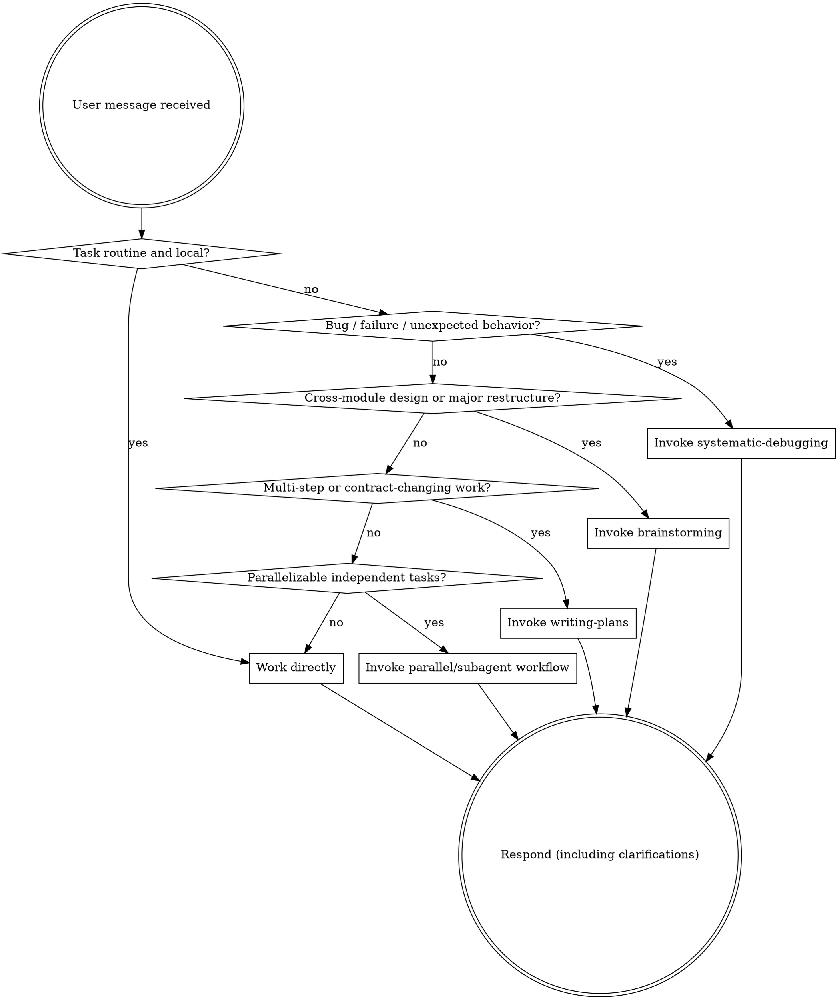

<SUBAGENT-STOP>
If you were dispatched as a subagent to execute a specific task, skip this skill.
</SUBAGENT-STOP>

<REPOSITORY-LOCAL-POLICY>
In this repository, do NOT force superpowers workflows onto every task.

Small questions, direct code reading, tiny local fixes, simple page tweaks, one-field API changes, and straightforward implementation work may proceed directly without invoking a superpowers skill.

Use superpowers when the workflow materially improves correctness, coordination, or risk control.
</REPOSITORY-LOCAL-POLICY>

## Instruction Priority

Superpowers skills override default system prompt behavior, but **user instructions always take precedence**:

1. **User's explicit instructions** (CLAUDE.md, GEMINI.md, AGENTS.md, direct requests) — highest priority
2. **Superpowers skills** — override default system behavior where they conflict
3. **Default system prompt** — lowest priority

If CLAUDE.md, GEMINI.md, or AGENTS.md says "don't use TDD" and a skill says "always use TDD," follow the user's instructions. The user is in control.

## How to Access Skills

**In Claude Code:** Use the `Skill` tool. When you invoke a skill, its content is loaded and presented to you—follow it directly. Never use the Read tool on skill files.

**In Copilot CLI:** Use the `skill` tool. Skills are auto-discovered from installed plugins. The `skill` tool works the same as Claude Code's `Skill` tool.

**In Gemini CLI:** Skills activate via the `activate_skill` tool. Gemini loads skill metadata at session start and activates the full content on demand.

**In other environments:** Check your platform's documentation for how skills are loaded.

## Platform Adaptation

Skills use Claude Code tool names. Non-CC platforms: see `references/copilot-tools.md` (Copilot CLI), `references/codex-tools.md` (Codex) for tool equivalents. Gemini CLI users get the tool mapping loaded automatically via GEMINI.md.

# Using Skills

## The Rule

**Check whether a superpowers workflow materially helps before starting heavyweight process.**

In this repository:
- Simple questions and tiny edits do **not** require a superpowers skill.
- Bug, test, build, and integration failures should usually invoke `systematic-debugging`.
- Cross-module design, menu/permission/App model changes, complex page restructuring, and tasks likely to take more than half a day should usually invoke `brainstorming`.
- Multi-step, multi-file, cross-frontend-backend, migration, or contract-changing work should usually invoke `writing-plans`.
- Claims of completion should usually invoke `verification-before-completion`.
- Independent parallelizable tasks should usually invoke `dispatching-parallel-agents` or `subagent-driven-development`.

If a skill is clearly helpful, use it. If the task is routine and local, work directly.

## Red Flags

These thoughts mean STOP and re-evaluate whether you're overusing or underusing workflows:

| Thought | Reality |
|---------|---------|
| "Every task needs the full superpowers chain" | In this repo, many local tasks should proceed directly. |
| "This bug is obvious, I'll patch first" | Bug/failure work should still start with `systematic-debugging`. |
| "This is a big architecture shift, I'll just code it" | Major cross-module work should still go through design/plan. |
| "We finished coding, no need to verify" | Completion claims still require `verification-before-completion`. |
| "Let's review every tiny task" | Review is valuable, but defaulting to review on every tiny step is overkill here. |
| "I remember the old rules" | This repository intentionally overrides the heavier default behavior. |

## Skill Priority

When multiple skills could apply, use this order:

1. **Debugging / verification skills first** when the task is about failure, correctness, or delivery risk
2. **Design / planning skills second** when the task is broad enough to justify them
3. **Execution / delegation skills third** when there is already a clear path to implementation

"Fix this bug" → `systematic-debugging` first.
"Restructure menu / permission / App model" → `brainstorming` first.
"Implement this small local fix" → work directly, then verify.

## Skill Types

**Rigid** (debugging, verification): Follow exactly when invoked.

**Flexible** (brainstorming, review, worktree, TDD in this repository): Adapt trigger conditions to the task and the repository's actual workflow.

The skill itself tells you which.

## User Instructions

Instructions say WHAT, not HOW. "Add X" or "Fix Y" doesn't mean skip workflows.
