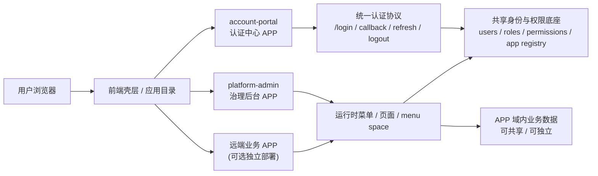
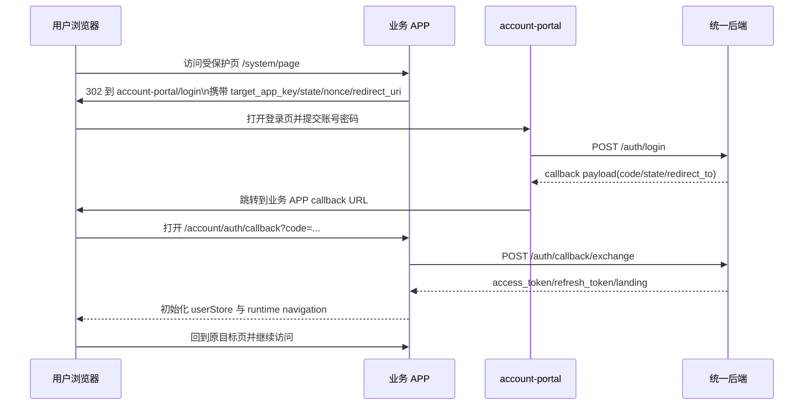

# 多 APP 混合承载基础设计

## 1. 文档目标

本文固定 `tsk_01KNYXJ3VCJFPYJ6DGDKAY` 根节点 1、2 的分析结论，作为后续 Phase A/B/C 设计与实现的前置真相源。

- 目标：收口当前仓库里 `App`、`AppHostBinding`、`MenuSpace`、`UIPage`、`account-portal` 试点的真实职责边界。
- 目标：明确多 APP 架构的术语、入口匹配优先级、默认首页与切换规则、实现链路纪律。
- 非目标：本文不直接引入新表/新字段，不替代 Phase A/B/C 的详细实现设计。

## 2. 当前现状盘点

### 2.1 APP 与入口绑定

- `apps` 是治理对象，表达 APP 的稳定身份、默认空间、空间模式和认证模式；它不直接描述某个页面或某个菜单。对应模型见 `backend/internal/modules/system/models/app.go`。
- `app_host_bindings` 是 Level 1 入口解析规则，只负责把 `host + path` 解析成某个 APP。它不负责菜单空间权限，也不负责页面注册。对应模型见 `backend/internal/modules/system/models/app.go`。
- 当前 APP 入口匹配类型只有四种：`host_exact`、`host_suffix`、`path_prefix`、`host_and_path`。后续部署拓扑必须由这些匹配类型配合 `App.AuthMode`、`App.SpaceMode` 表达，不引入 `deployment_type` 枚举。

### 2.2 MenuSpace 与 UIPage

- `menu_spaces` 是某个 APP 内的菜单视图边界，承担默认首页、空间访问模式、按 host 切换菜单目标等职责；它不参与权限公式，只是承载菜单组织。对应模型见 `backend/internal/modules/system/models/menu_space.go`。
- `menu_space_entry_bindings` 是 Level 2 入口解析规则，只在 APP 已确定后，把请求进一步解析到某个菜单空间；单空间 APP 直接短路到 `App.DefaultSpaceKey`。对应实现见 `backend/internal/modules/system/app/service.go`。
- `ui_pages` 是页面定义层，表达路由、组件、访问模式、页面归属与展示范围。`AppKey` 代表页面归属到哪个 APP，`SpaceKey` 与 `VisibilityScope` 决定页面暴露到哪个空间。对应模型见 `backend/internal/modules/system/models/model.go` 与 `backend/internal/modules/system/page/service.go`。
- 页面类型当前只有四种：`inner`、`standalone`、`group`、`display_group`。其中：
  - `inner` 必须挂到菜单或上级页面。
  - `standalone` 不能挂到菜单或上级页面。
  - `group`、`display_group` 是无实际组件路由的结构节点。
- 页面可见性当前只有三种有效语义：`inherit`、`app`、`spaces`。内页强制 `inherit`；无父级的独立页/分组页默认提升为 `app`，仅显式绑定时才落到 `spaces`。
- 页面访问模式当前只有四种有效值：`inherit`、`public`、`jwt`、`permission`。只有 `permission` 模式允许持有 `permission_key`。

### 2.3 account-portal 试点真实链路

- 后端入口解析链是：`AppContext` 中间件读取请求 `host/path`，调用 `ResolveAppEntry` 解析 APP，再调用 `ResolveMenuSpaceEntry` 或 `ResolveCurrentSpaceKey` 解析空间，最后把 `app_key`、`space_key`、`resolved_by` 写入请求上下文。实现见 `backend/internal/api/middleware/app_context.go`。
- `ResolveAppEntry` 当前优先级是：显式 `requestedAppKey` 命中且 APP 存在 → 启用中的 `app_host_bindings` 按具体度命中 → 默认 APP → `fallback_default`。实现见 `backend/internal/modules/system/app/service.go`。
- `account-portal` 已通过 seed 落了 `/account` 的 `path_prefix` 入口绑定，本地单域名场景默认命中该 APP；同时保留 `host_exact` 的子域名示例用于后续独立域名部署。seed 见 `backend/internal/pkg/permissionseed/register_seed.go`。
- 前端未登录路由守卫会先尝试注册公开 runtime 页面；`/account/*` 路径会被直接推断为 `account-portal`，并通过公开 runtime 路径完成动态路由注入。实现见 `frontend/src/router/guards/beforeEach.ts`。
- 公开认证页在路由转换时会保持绝对路径，不再套进主后台的一级 Layout，避免多个 `/account` 容器互相遮挡。实现见 `frontend/src/router/core/RouteTransformer.ts`。

### 2.4 account-portal 与主壳当前耦合点

- 登录页仍直接依赖 `userStore`、`collaborationWorkspaceStore`、`menuSpaceStore`，并在登录成功后主动刷新工作空间、菜单空间与路由状态；说明当前 `account-portal` 仍共享主壳的用户上下文与空间解析能力。见 `frontend/src/views/auth/login/index.vue`。
- 登录页还直接调用 `resetRouterState`，说明公开认证流会修改主壳的动态路由注册状态，而不是完全独立运行。见 `frontend/src/views/auth/login/index.vue`。
- 注册页依赖 `fetchRegisterContext(window.location.host, window.location.pathname)` 从当前 URL 推断入口策略，这意味着 `account-portal` 已经按“入口驱动页面上下文”工作，但它仍沿用同一个前端工程与同一套用户 store。见 `frontend/src/views/auth/register/index.vue`。

### 2.5 APP 级隔离当前状态

- `menuSpaceStore` 已经按 `appKey` 维护 `menuSpaceConfigMap`、`overrideSpaceKeyMap`、`loadedAppKeys`，菜单空间配置具备 APP 维度缓存与切换能力。见 `frontend/src/store/modules/menu-space.ts`。
- `useManagedAppScope` 已经把“当前管理 APP”写进 `managed-app:*` 键，具备局部 APP 作用域记忆。见 `frontend/src/hooks/business/managed-app-scope.ts` 与 `frontend/src/hooks/business/useManagedAppScope.ts`。
- 但全局持久化尚未完全 APP 隔离：`app-context`、`menu-space`、`iframeRoutes`、`user`、`setting`、`worktab` 仍使用固定 localStorage/sessionStorage key，因此当前只能说“局部隔离已开始，全局壳层仍共享状态”。

## 3. 核心术语与配置组合模型

### 3.1 术语

| 术语 | 角色 |
|---|---|
| App | 治理对象，定义一个独立应用的标识、默认空间、认证模式、空间模式与品牌/能力扩展位 |
| AppHostBinding | APP 入口绑定，负责把请求解析到 APP |
| MenuSpace | APP 内的菜单视图边界，负责默认首页与空间访问策略 |
| MenuSpaceEntryBinding | 菜单空间入口绑定，负责把请求解析到具体空间 |
| UIPage | 页面定义，负责路由、组件、访问模式、空间暴露规则 |
| account-portal | 当前公共认证中心试点 APP，承载登录/注册/找回密码等公开认证页 |

### 3.2 部署拓扑的配置组合心智模型

不引入 `deployment_type`。对外沟通时仅使用“配置组合”表达拓扑：

| 组合 | 沟通语义 | 说明 |
|---|---|---|
| `path_prefix + inherit_host + single/multi` | 嵌入式 / 同域挂载 | 典型试点就是 `account-portal` 的 `/account/*` |
| `host_exact + shared_cookie + multi` | 独立域名 + 共享会话 | 适合 APP 子域名独立部署、同登录态切换 |
| `host_exact + centralized_login + multi` | 独立域名 + 认证中心 | 适合后续 Phase C 的中央认证流 |

说明：

- `MatchType` 决定“请求如何命中 APP”。
- `AuthMode` 决定“命中 APP 之后如何处理登录态”。
- `SpaceMode` 决定“APP 内部是否需要二级菜单空间解析”。

## 4. 入口匹配、首页与切换规则

### 4.1 APP 入口匹配优先级

APP 入口解析固定为：

1. 显式 `requestedAppKey`，且该 APP 实际存在。
2. `app_host_bindings` 命中，命中规则按 `PatternSpecificity + Priority*10` 排序。
3. 默认 APP。
4. `fallback_default`。

约束：

- `path_prefix` 与 `host_and_path` 必须同时看 path。
- `host_exact` 与 `host_suffix` 主要看 host。
- 入口匹配只决定 APP，不越权决定页面或权限。

### 4.2 空间解析优先级

空间解析固定为：

1. 如果 APP 是多空间，先尝试 `menu_space_entry_bindings`。
2. 仅当命中空间且当前用户有权访问时，才接受该入口空间。
3. 否则回退到 `ResolveCurrentSpaceKey` 的常规解析。
4. 再失败则落回 APP 默认空间。

### 4.3 redirect、默认首页与 APP 切换

- 登录页会反复解码 `redirect` 参数，但会拒绝把用户再次导回 `/auth/login` 或 `/account/auth/login`，防止登录页自循环。
- 默认首页优先级为：当前空间显式配置首页 → 默认空间首页 → `/workspace/inbox` → `/dashboard/console` → 第一个可用路径。
- 跨空间/跨 host 菜单时，`menuSpaceStore.resolveSpaceNavigationTarget()` 会根据 host binding 决定使用前端 router 还是整页 `location` 跳转。
- 公开认证页保持绝对路径，不应被 APP 内普通 Layout 包裹；这是后续多 APP 并存时必须保留的规则。

## 5. 当前必须遵守的架构纪律

### 5.1 模型与数据链路

- 模型变更必须整链完成：`Model -> Migration -> Seed/Ensure -> build/test`。
- 默认数据走 seed / ensure，不把长期默认状态反复写进迁移链。
- 新模块、新表、新接口必须显式回答：是否带 `tenant_id`、是否在仓储层强制过滤。

### 5.2 API 链路

- API 一律 OpenAPI-first：先改 `backend/api/openapi/`，再 bundle、ogen、gen-permissions、**重启后端**、前端 `pnpm run gen:api`，最后修 sub-handler/service 与前端调用。
- 禁止手改 `backend/api/gen/` 与 `frontend/src/api/v5/` 生成产物。
- 权限判断只走 `backend/internal/pkg/permission/evaluator`。

### 5.3 前后端联动链路

- 后端契约一旦变更，同一任务内必须完成后端实现、前端生成物刷新、前端调用适配与至少一次联编校验。
- 前端 runtime 改动必须串行检查 `store -> router -> component`，完成标准至少包含 `pnpm exec vue-tsc --noEmit`；若涉及构建行为，继续补 `pnpm build`。
- 配置/绑定变更必须同步检查 seed、中间件、路由守卫、runtime 解析逻辑，禁止只改后台表单或只改数据库。

### 5.4 后续实现节点 instruction 规范

后续每个实现类节点的 `instruction` 至少要包含：

- 变更范围：明确到模块、文件或生成链。
- 强制链路：引用本节中适用的模型/API/runtime 链路。
- 完成标准：至少写清需要跑的 build/test/gen 命令。
- 禁止拆分声明：不能把同一条链路拆成“先改模型，后补 seed/前端”的半成品任务。

推荐模板：

```md
变更范围：model + migration + seed + openapi + handler + frontend runtime

强制链路：
1. 先改 OpenAPI / model
2. 再刷新生成物（含 gen-permissions），并重启后端让 seed 生效
3. 再改 sub-handler / service / frontend
4. 最后跑 go test 与 vue-tsc

完成标准：
- `go test ./internal/api/handlers -count=1`
- `pnpm exec vue-tsc --noEmit`

禁止拆分：
- 不允许只落一半链路后进入下游开发
```

## 6. 本轮明确不做

本轮基础设计明确排除以下事项：

- 不引入微前端框架，如 `qiankun`、`wujie`。
- 不在本阶段引入 WebSocket/实时通信新架构。
- 不把多 APP 方案扩展成多前端工程或第二套后台。
- 不在本阶段展开 i18n 多语言、插件化、跨服务 RPC、GraphQL 等额外议题。
- 不引入 `deployment_type` 这类把配置组合重新固化成枚举的快捷字段。

## 7. 后续 Phase 的直接输入

基于当前仓库，后续 Phase A/B/C 设计与实现都应直接继承以下结论：

- APP 是治理对象，入口绑定与页面定义必须继续分层，不可把入口规则塞回页面模型。
- `account-portal` 已经具备“公共认证中心”的雏形，但仍共享主壳 store 与动态路由状态；Phase C 的关键不是再造一套登录页，而是把它从主壳共享状态里逐步解耦。
- APP 级持久化隔离目前只完成了局部能力，Phase A runtime 改造应优先补齐全局状态命名空间与路由缓存清理。
- 设计沟通必须坚持“配置组合表达拓扑”，避免回到枚举驱动的僵化建模。

## 8. Phase A 设计提案

本节开始是设计提案，不是当前已实现行为。

### 8.1 App 主模型扩展字段

保持 `App.SpaceMode`、`App.AuthMode` 顶层字段不变，只补“入口 URL + 能力描述”：

| 字段 | 类型 | 作用 |
|---|---|---|
| `frontend_entry_url` | `varchar` | 面向用户的前端入口地址；path_prefix 场景允许存相对路径，如 `/account` |
| `backend_entry_url` | `varchar` | 当前 APP 对应的 API/Gateway 入口地址；同域场景可为空表示继承当前 host |
| `health_check_url` | `varchar` | 后台 dry-run、探活与治理页展示使用 |
| `capabilities` | `jsonb` | 运行能力声明，驱动 runtime、后台治理与前端切换 |

建议的 `capabilities` 结构：

```json
{
  "routing": {
    "entry_mode": "path_prefix",
    "route_prefix": "/account",
    "supports_public_runtime": true
  },
  "runtime": {
    "kind": "local",
    "supports_dynamic_routes": true,
    "supports_worktab": false
  },
  "navigation": {
    "supports_multi_space": false,
    "default_landing_mode": "menu_space"
  },
  "integration": {
    "supports_app_switch": true,
    "supports_broadcast_channel": false
  }
}
```

设计原则：

- 不把 `deployment_type` 再包装回顶层枚举。
- `frontend_entry_url`、`backend_entry_url`、`health_check_url` 是“运维入口”字段，不替代 `app_host_bindings` 的解析规则。
- `capabilities` 只放会影响 runtime/治理决策的声明，不复制 `space_mode`、`auth_mode` 这类已有顶层字段。

### 8.2 capabilities / auth / branding / version 的分层

为了避免 `capabilities` 继续膨胀，建议分四层：

| 层 | 存放位置 | 建议内容 |
|---|---|---|
| capabilities | `apps.capabilities` | 路由能力、动态路由、工作台、跨 APP 通信、空间能力等运行时开关 |
| auth | 顶层 `auth_mode` + `meta.auth` | 登录页路径、回跳白名单策略、是否允许公共入口 |
| branding | `meta.branding` | APP 名称、副标题、logo、主题 token、认证页布局风格 |
| version | `meta.version` | `frontend_manifest_version`、`backend_contract_version`、`min_supported_platform_version` |

建议结构：

```json
{
  "auth": {
    "login_path": "/account/auth/login",
    "logout_path": "/account/auth/login",
    "allow_public_entry": true
  },
  "branding": {
    "display_name": "账户中心",
    "theme_key": "account-portal",
    "auth_layout": "split"
  },
  "version": {
    "frontend_manifest_version": "v1",
    "backend_contract_version": "v1",
    "min_supported_platform_version": "5.0"
  }
}
```

### 8.3 页面归属、代码归属、部署归属分离规则

后续必须显式分离三类归属：

| 维度 | 真相源 | 说明 |
|---|---|---|
| 页面归属 | `ui_pages.app_key` | 页面属于哪个 APP，由哪个 APP 的 runtime 注册 |
| 代码归属 | `ui_pages.component` + 前端组件目录 | 页面组件由哪个前端包/目录提供 |
| 部署归属 | `app_host_bindings` + `frontend_entry_url/backend_entry_url` | 用户通过什么 host/path 命中 APP |

约束：

- `ui_pages` 不承载部署语义，不保存“这个页面发布到哪个域名”。
- `app_host_bindings` 不承载页面语义，不保存具体页面组件。
- `menu_space_entry_bindings` 只决定“哪个空间接住当前请求”，不复制页面定义。
- 仅 `PageSpaceBinding` 继续用于“少量无父级独立页”的空间暴露控制，不把它升级成第二套页面路由系统。

### 8.4 菜单空间继承、默认首页与入口绑定规则

建议固定以下规则：

1. APP 命中后，先确定 `App.DefaultSpaceKey`。
2. 如果 `App.SpaceMode=single`，直接使用默认空间。
3. 如果 `App.SpaceMode=multi`，且命中了 `MenuSpaceEntryBinding` 且用户有权访问，则覆盖当前空间。
4. `MenuSpace.DefaultHomePath` 仍是该空间首页唯一真相源。
5. `AppHostBinding.DefaultSpaceKey` 仅作为入口兜底，不覆盖已经解析成功的空间首页规则。

因此：

- “入口绑定”解决的是首个落点空间。
- “默认首页”解决的是进入空间后的首个页面。
- “页面绑定”解决的是该页面能否暴露到该空间。

三者不能再混写到同一个字段里。

### 8.5 前端多 APP runtime 切换

#### 8.5.1 app context / store / worktab 按 APP 隔离

建议把前端状态分成两层：

- 全局共享层：`user`、认证 token、语言、主题、当前 workspace。
- APP 隔离层：`app-context`、`menu-space`、`worktab`、`iframeRoutes`、搜索历史、运行时缓存。

建议补齐以下命名空间：

| 模块 | 当前状态 | Phase A 建议 |
|---|---|---|
| `app-context` | 固定 key `appContextStore` | 改为 `app-context:{appKey}` 或全局主索引 + app 子键 |
| `menu-space` | 固定 key `menu-space` | 改为 `menu-space:{appKey}` |
| `worktab` | 固定 key `worktab` | 改为 `worktab:{appKey}` |
| `iframeRoutes` | 固定 key `iframeRoutes` | 改为 `iframeRoutes:{appKey}` |
| `managed-app:*` | 已局部隔离 | 保留并继续复用 |

`appContextStore` 建议增加：

- `currentRuntimeAppKey`
- `lastRuntimeAppKey`
- `switchEpoch`
- `runtimeSessionKey`

其中 `switchEpoch` 用来驱动路由缓存、工作台和 iframe 缓存的统一失效。

#### 8.5.2 动态路由、布局与缓存按 APP 切换

建议 `RouteRegistry` 增加“当前已注册 APP”概念：

- 当 `runtimeAppKey` 变化时，先 `unregister`，再按新 APP 的 manifest 注册。
- `keepAliveExclude` 与 `IframeRouteManager` 都按 `appKey` 分区。
- `validateWorktabs` 只校验当前 APP 的标签，不在 APP 切换时拿旧 APP 路由做有效性判断。

布局建议：

- `account-portal` 这类公开认证 APP 继续走“绝对路径 + 轻壳”。
- `platform-admin` 与后续业务 APP 走“管理壳 + 动态菜单 + worktab”。
- 是否展示 `worktab`、侧边菜单、空间徽标，由 `capabilities.runtime` 驱动，而不是写死在全局配置里。

#### 8.5.3 统一应用目录与 APP 切换入口

建议把“应用目录”做成独立入口，而不是散落在各处快捷入口中：

- Header 保留一个统一 `AppSwitcher / Application Directory` 入口。
- `fast-enter` 继续作为快捷方式，但不再承担唯一 APP 切换职责。
- 应用目录只展示当前用户有权访问且状态正常的 APP，排序优先级建议为：当前 APP、默认 APP、最近访问 APP、其他 APP。

#### 8.5.4 壳层保留与重置策略

建议切 APP 时：

- 保留：用户信息、token、语言、主题、当前 workspace。
- 软重置：`menu-space` 当前空间、动态路由注册、worktab、iframeRoutes、首页缓存。
- 强重置：若切到 `supports_worktab=false` 或 `supports_dynamic_routes=false` 的 APP，则直接清空 worktab 与 keepAlive 状态。

### 8.6 前端构建与存储隔离

#### 8.6.1 按 APP 的代码分割与懒加载

建议后续组件路径按 APP 形成明确边界：

- `account-portal/*` 组件优先收拢到独立目录。
- `platform-admin/*` 继续承载管理壳与系统治理页面。
- 路由组件按 `appKey` 维度设置稳定 chunk 名，避免一个 APP 变动导致另一个 APP 首屏缓存抖动。

#### 8.6.2 localStorage / sessionStorage 命名空间

建议统一命名格式：

```text
sys-v{version}:app:{appKey}:{storeId}
```

这样可以同时满足：

- 版本升级迁移。
- APP 隔离。
- 后续灰度或多入口环境的冲突规避。

### 8.7 错误边界与 APP 间通信

#### 8.7.1 APP 级错误边界

建议在 APP 壳层外再加一层按 `appKey` 划分的 Error Boundary：

- 公开认证 APP 崩溃时，只回落到认证页错误态，不污染主后台壳层。
- 管理 APP 崩溃时，保留 header 与应用切换入口，允许用户切换到其他 APP 或重新加载当前 APP。

#### 8.7.2 同域场景下的跨 APP 通信

建议优先级：

1. 同 SPA 内切换：直接通过 router + app-context 切换，不做额外通信。
2. 同域多入口页签：优先 `BroadcastChannel`，用于登录完成、退出登录、主题切换等低频事件。
3. 跨域场景：改走重定向参数或服务端会话，不依赖浏览器内通信。

本阶段不建议引入复杂事件总线或微前端总线协议。

### 8.8 公共认证中心与跨 APP 入口体验

#### 8.8.1 account-portal 的职责上限

建议把 `account-portal` 的职责明确限制为：

- 登录
- 注册
- 找回密码
- 认证完成后的回跳
- 面向匿名用户的基础品牌展示
- OAuth/OIDC 风格授权确认页（仅当 Phase C 需要显式授权确认时启用）

不建议让它继续承载：

- 管理后台菜单
- 复杂工作台
- 业务域页面
- APP 专属配置管理
- 业务侧 refresh / logout 逻辑分叉

#### 8.8.2 品牌、布局与回跳策略

建议：

- 品牌信息从 `apps.meta.branding` 读取，避免登录页继续只依赖全局 `AppConfig.systemInfo`。
- 认证页布局允许按 APP 配 `split / centered / minimal` 三种样式，但组件骨架仍共用。
- 回跳目标必须同时校验 `target_app_key`、`target_navigation_space_key`、`target_home_path`，并与后端白名单策略一致。

责任拆分建议：

- 后端负责：
  - 解析 `target_app_key / redirect_uri / state / nonce`；
  - 校验 redirect 白名单、来源 host、授权码有效性；
  - 下发可消费的 branding 配置快照和最终 landing 结果；
  - 决定“允许回跳哪里”，前端不自行扩大范围。
- 前端负责：
  - 按 `apps.meta.branding` 或认证中心返回的 branding snapshot 渲染 logo、标题、副标题、布局样式；
  - 展示“你正在登录哪个 APP / 登录后将回到哪里”的只读提示；
  - 在本地做有限兜底校验，但不把本地校验当真相源。
- branding 配置来源统一约束为：
  - APP 注册表中的 `apps.meta.branding` 是长期配置真相源；
  - 认证流程中的 branding snapshot 只是运行时快照，用于避免回跳中途 APP 配置变化导致展示抖动。

布局可配置边界：

- 可配置：logo、品牌名、副标题、主题 key、背景布局模板（`split / centered / minimal`）。
- 不可配置：协议表单字段含义、redirect 参数语义、callback 参数结构、来源校验规则。
- 原则：品牌可变，认证协议不可变；避免“为了定制登录页”把协议层做成每 APP 一套。

#### 8.8.3 独立认证 APP 的剥离路径

建议按三步逐步把认证流从主壳共享状态中剥离：

1. Phase C 设计约束：
- `account-portal` 继续使用同仓前端工程，但把认证页视为“轻壳 APP”，不再默认依赖后台菜单、worktab、动态路由缓存。
- 登录、注册、找回密码页只保留认证必要 store：用户身份、redirect 上下文、branding 快照、一次性 state/nonce。

2. Phase C 实现目标：
- 路由层剥离：认证页不再调用后台壳专属的动态菜单初始化作为前置条件。
- store 层剥离：把 `account-portal` 必需状态收敛到独立命名空间，避免和 `platform-admin` 共用 worktab、menu-space、iframeRoutes。
- 跳转层剥离：登录成功后由 callback / landing 协议驱动回跳，不让认证页自己决定业务 APP 的深层路由。

3. 收口判定：
- 认证页崩溃时不会污染后台壳；
- 退出登录时能区分“只退出当前业务 APP”与“退出认证中心全局会话”；
- 认证 APP 不再要求加载后台菜单树才能完成登录或回跳。

#### 8.8.4 tenant / workspace 在跨 APP 下的连续性

Phase C 不引入“每个 APP 自己解释 tenant/workspace”的第二套语义，统一约束如下：

- `tenant_id` 仍是平台级主边界，跨 APP 不变；APP 只能消费当前 tenant，上下文切换仍由平台统一完成。
- `workspace` 是登录后授权上下文，不是认证中心私有状态；认证中心只负责把“当前会话对应的 auth workspace”放进 token / callback 交换结果。
- `account-portal` 允许展示“你将进入哪个 workspace / space”，但不自己计算 workspace 权限，不缓存业务侧 workspace 快照。

连续性规则：

1. 登录前：
- 业务 APP 若已知当前目标 workspace，可把 `target_workspace_id` 作为只读提示参数传给认证中心。
- 认证中心只记录原始意图，不在登录页做 workspace 可用性判定。

2. 登录成功 / callback 交换后：
- 认证中心返回 `tenant_id + current_auth_workspace_id + current_auth_workspace_type + collaboration_workspace_id(optional)`。
- 业务 APP 以交换结果为准恢复 `userStore` 与 workspace 相关 store，不再从旧 localStorage 推断跨 APP 的 workspace。

3. 跨 APP 再跳转：
- 若目标 APP 不支持当前 workspace 类型，不能静默沿用旧 workspace，必须降级到该 APP 默认 landing 或重新选择 workspace。
- `tenant_id` 可以连续继承；`workspace` 是否可继承必须由目标 APP 的 capability 与权限结果共同决定。

建议的前后端责任：

- 后端负责：
  - 在 token / callback 交换结果里带出当前 tenant/workspace 身份；
  - 对不兼容的 workspace 给出显式降级 landing，而不是让前端猜。
- 前端负责：
  - 把认证中心返回的 workspace 当成“候选上下文”，再触发本 APP 的 runtime 初始化；
  - 若 runtime 校验失败，清理仅与目标 APP 相关的 workspace/view 状态，不回写认证中心全局态。

#### 8.8.5 permission / menu space / landing 的跨 APP 语义

Phase C 下三者必须继续分层，不能被 callback 流重新糊成一个字段：

- permission：回答“当前用户在目标 workspace 内能做什么”。
- menu space：回答“当前 APP 应展示哪组菜单壳与菜单树”。
- landing：回答“认证完成后第一跳去哪里”。

统一语义建议：

1. `landing` 只是一跳结果：
- 允许返回 `target_app_key + navigation_space_key + home_path`。
- 不允许把完整菜单树、按钮权限、页面缓存放进 landing。

2. `menu space` 仍由目标 APP runtime 拉取：
- callback 完成后，前端按 `target_app_key + navigation_space_key` 刷新 runtime navigation。
- 若 `navigation_space_key` 缺失或已失效，回退到目标 APP 默认 space，而不是卡在认证页。

3. `permission` 不经认证中心透传：
- 认证中心最多返回身份声明和 landing 意图；
- 目标 APP 必须重新走 `/auth/me + runtime navigation + evaluator` 链路获取真实权限。

4. 冲突处理优先级：
- 显式 callback 交换结果的 `home_path`
- 目标 APP 当前有效 `navigation_space_key` 的首页
- 目标 APP 默认首页
- 平台兜底页（如 `/dashboard/console` 或 `/workspace/inbox`）

约束：

- 认证中心不能为了“回跳更快”直接缓存或签发业务 APP 的菜单树。
- 前端不能把旧 APP 的 `menu-space/worktab/keepAlive` 直接带入新 APP。
- callback 只负责“身份切换完成”，不负责“权限初始化完成”。

#### 8.8.6 必须中心化的共享能力 vs 允许下沉的领域能力

建议按“安全边界是否必须统一”划分：

必须中心化的能力：

- 账号认证、密码校验、refresh token 轮换、session 失效
- redirect 白名单与 callback 来源校验
- 全局 logout、一次性交换码、state/nonce 生命周期
- tenant / 当前 auth workspace 身份声明
- branding snapshot 的最终签发格式

允许下沉到 APP 侧的能力：

- 登录后首页推荐与本 APP fallback landing
- APP 专属 runtime navigation 组装
- APP 专属 workspace 兼容性检查
- 业务域 profile 补充信息、引导页、首次登录 onboarding
- 非安全性的主题、布局微差异与匿名页文案

不允许模糊地带：

- 业务 APP 不签第二套 refresh token。
- 认证中心不生成业务 APP 权限树。
- 任一 APP 都不能自行放大 redirect 白名单或全局 logout 范围。

#### 8.8.7 多 APP 灰度切流与 AB 发布策略

Phase C 的灰度必须按 `app_key + version + host binding` 三个维度表达，避免“认证中心已灰度、业务 APP 未灰度”时行为失配。

建议规则：

1. 认证中心灰度：
- 先灰 callback / exchange 新协议，再灰登录页 UI。
- 协议灰度优先基于 host binding 或用户白名单，不能只靠前端 query 参数切流。

2. 业务 APP 灰度：
- 目标 APP 是否启用 centralized callback，由 APP 自己声明 capability / version compatibility。
- 未加入灰度的 APP 继续走旧登录链路或旧 landing 回退，不强制切新 callback。

3. AB 实验边界：
- 允许在登录页做 branding / layout / copy 的 AB；
- 不允许对 token 结构、callback 参数、redirect 校验规则做用户侧随机 AB。

4. 回滚策略：
- 一旦 callback 交换失败率异常，可只回滚认证中心 callback 页面或业务 APP callback handler；
- 认证协议字段只能加法演进，回滚时保留旧字段兼容窗口，不能直接删字段。

#### 8.8.8 APP 间版本兼容矩阵与前后端配对校验

建议为 Phase C 明确维护一份最小兼容矩阵：

| 认证中心 | 业务 APP 前端 | 业务 APP 后端 | 兼容性 |
|---|---|---|---|
| `callback-v1` | `callback-v1` | `exchange-v1` | 完全兼容 |
| `callback-v1` | `legacy-login` | `legacy-refresh` | 允许，通过旧入口回退 |
| `callback-v2` | `callback-v1` | `exchange-v1` | 仅在字段向后兼容时允许 |
| `callback-v2` | `legacy-login` | `legacy-refresh` | 不允许直接切流 |

配对校验建议：

- 后端在 app runtime / host binding 配置中声明 `supported_auth_protocols`、`min_callback_version`。
- 前端构建产物通过 `X-App-Version` 或 manifest 暴露 `auth_protocol_version`。
- callback 页面加载时，若发现认证中心与目标 APP 版本不兼容，直接降级到安全提示页，不继续交换 token。

验收口径：

- 兼容性问题要在 callback 前或 callback 交换时显式失败，不能等到业务首页 404 才暴露。
- 新版本上线必须满足“新认证中心兼容旧 APP”或“旧认证中心兼容新 APP”至少一侧成立，避免双端同时强切。

## 9. Phase A 设计输出到实现的映射

本轮设计提案对应后续实现叶子节点的直接映射如下：

| 设计点 | 后续实现入口 |
|---|---|
| `frontend_entry_url/backend_entry_url/health_check_url/capabilities` | `4/1/1`、`4/2/1`、`4/4/1` |
| 页面/部署/空间三类归属分离 | `4/2/2`、`4/3/2` |
| APP 级 store/worktab/storage 隔离 | `4/3/1`、`4/3/4` |
| 公开认证 APP 的轻壳与错误边界 | `4/3/3`、`4/4/2` |
| 应用目录与切换入口 | `4/4/2` |

## 10. Phase B 设计提案（独立域名 + shared_cookie）

本节是 Phase B 设计输入，覆盖 `host_exact/host_suffix` 独立域名 APP 的入口、安全、会话、运维与前端接入策略。

### 10.1 入口与网关分发

#### 10.1.1 `host_exact/host_suffix` 的收益与边界

- 收益：
- 与 `path_prefix` 相比，独立域名可把 APP 的缓存、证书、限流、故障隔离到子域级别。
- 适合“同一账号体系 + 多业务域 APP”并行演进，不强制所有 APP 共享前端壳。
- 边界：
- `host_exact/host_suffix` 只解决“入口命中哪个 APP”，不解决页面归属和权限归属。
- `shared_cookie` 与 `centralized_login` 是认证策略，不是入口类型；两者不能写进 `MatchType`。
- `host_suffix` 只用于同组织子域聚合，禁止用于第三方不受控域。

#### 10.1.2 统一网关 vs 独立入口

建议保留两种拓扑，并通过配置组合表达：

- 统一网关：`edge gateway -> app router -> backend services`，适合统一证书、统一审计、统一限流。
- 独立入口：APP 自带网关或 ingress，统一平台只保留认证中心与策略下发能力。

路由分发规则：

1. 先按 `host` 命中 `AppHostBinding`。
2. 再按 `X-App-Key` 与 host 命中结果做一致性校验（防伪造）。
3. 最后把请求下发到 APP 对应上游（service discovery 或静态 upstream）。

#### 10.1.3 按 APP 的限流、熔断与版本路由

- 所有网关策略至少带 `app_key` 维度：`rate_limit`, `circuit_breaker`, `retry_budget`, `timeout_budget`。
- 版本路由采用“同 APP 内按 API 版本分流”，禁止跨 APP 复用版本键导致串流。
- 建议 header：
- `X-App-Key`: 当前 APP
- `X-App-Version`: 前端构建版本（用于灰度与回滚定位）
- `X-Request-ID`: 贯穿 trace 与日志

### 10.2 跨域安全与会话策略

#### 10.2.1 Cookie / SameSite / CORS / CSRF / CSP 基线

- shared_cookie 场景：Cookie Domain 设为主域（如 `.example.com`），`Secure + HttpOnly + SameSite=None`。
- CORS：仅允许注册白名单来源，禁止 `*`；凭证模式必须显式 `Access-Control-Allow-Credentials: true`。
- CSRF：对状态变更接口强制双重校验（CSRF token + Origin/Referer）。
- CSP：按 APP 下发动态策略，至少限制 `script-src`, `frame-ancestors`, `connect-src` 到白名单域。

#### 10.2.2 redirect 白名单与开放跳转防护

后端协议层硬约束：

1. `redirect_uri` 必须命中 APP 维度白名单。
2. 目标地址必须校验 `scheme/host/path_prefix`，拒绝协议相对 URL 与双重编码绕过。
3. `target_app_key`、`target_navigation_space_key`、`target_home_path` 必须做组合校验。

前端兜底层：

- 仅消费后端签名通过的回跳参数。
- 若参数无效，回退到 APP 默认首页，不按前端自行拼接未知 URL。

#### 10.2.3 统一 token / refresh / logout 协议

- token 结构统一：`iss`（认证中心）、`aud`（目标 APP 或平台网关）、`tenant_id`、`session_id`、`scope`。
- refresh token 由认证中心统一发放与轮换，APP 仅透传刷新请求，不私自扩展 refresh 协议。
- logout 分两层：
- 局部登出：当前 APP session 失效。
- 全局登出：认证中心触发全部 APP session 失效，并广播登出事件。

协议落地建议补充如下：

1. 认证中心角色：
- `account-portal` 作为唯一认证中心，负责颁发 access token、refresh token、授权码/一次性交换码以及 session 生命周期管理。
- 业务 APP 不自己签发第二套 access token；最多只缓存认证中心发回的令牌或一次性交换结果。

2. 登录入口：
- 受保护页未登录时，业务 APP 重定向到认证中心登录入口，例如：
  `GET /account/auth/login?target_app_key=platform-admin&redirect_uri=https://admin.example.com/dashboard/console&navigation_space_key=default&state=...&nonce=...`
- `target_app_key` 表示回跳目标 APP。
- `redirect_uri` 必须是目标 APP 已登记白名单内的绝对地址。
- `navigation_space_key` 仅作为回跳提示，不作为权限放行依据。
- `state` 为一次性随机串，由发起方生成，认证中心原样带回。
- `nonce` 用于防回放，认证中心需在最终令牌或交换结果里绑定校验。

3. 登录成功返回：
- 同域/共享会话场景可直接回到 `redirect_uri`。
- `centralized_login` 场景不直接把 access token 挂在 URL 上，统一走两段式回跳：
  1) 认证中心回跳到业务 APP 的 callback URL；
  2) callback URL 再向认证中心交换一次性 code / exchange_token，拿到 token/session。
- 推荐 callback 形态：
  `GET /auth/callback?code=...&state=...`
- 不推荐把 `refresh_token`、长期 `access_token`、完整用户信息直接放在 query/hash。

4. callback 交换边界：
- `code` 必须一次性、短时效、绑定 `target_app_key + redirect_uri + nonce + session_id`。
- callback 交换接口必须同时校验：
  - `code` 未使用且未过期；
  - `target_app_key` 与当前 APP 一致；
  - `redirect_uri` 与授权阶段登记值一致；
  - `state` 与本地会话缓存一致；
  - `nonce` 与授权阶段记录一致。
- 任一条件不满足时，业务 APP 不继续重放回跳，直接降级到本 APP 默认首页或重新跳认证中心登录。

5. refresh 边界：
- 统一由认证中心暴露 refresh 接口，业务 APP 不新增 `/refresh-by-app` 一类变体。
- refresh 请求至少绑定 `refresh_token + client_app_key + session_id`。
- refresh 成功后必须轮换 refresh token，旧 token 立即失效，避免多 APP 并发刷新导致长期复用。
- 若 refresh 被拒绝（过期、撤销、aud 不匹配），业务 APP 只做两件事：
  - 清本地登录态；
  - 跳认证中心登录，不尝试本地兜底续命。

6. logout 边界：
- 局部登出：仅注销当前 APP 本地会话和当前 APP 绑定的 token/session 引用，不主动清其他 APP 已登录态。
- 全局登出：认证中心注销中心 session，并通知所有 APP 清理本地态；前端可辅以 `BroadcastChannel/postMessage`，但服务端中心 session 失效才是真相源。
- logout callback 也必须走白名单，禁止把登出后回跳开放成任意 URL。

7. 当前仓库与 Phase C 新增项的边界：
- 当前仓库已存在 `/auth/login`、`/auth/refresh`、`/auth/me`，返回体仍是 token body 形态。
- Phase C 新增协议不要求推翻现有登录实现，但必须新增：
  - `callback` 交换契约；
  - `target_app_key/redirect_uri/state/nonce` 入参与校验；
  - 统一 logout 契约；
  - 明确 `centralized_login` 下 token 不直挂 URL 的约束。

8. 退出策略矩阵：
- 认证中心态退出：
  - 清理认证中心 session、refresh token、一次性交换码缓存；
  - 若是“全局退出”，同步失效所有业务 APP 绑定 session；
  - 回跳只允许去认证中心公开页或白名单内已登记的登出完成页。
- 业务 APP 态退出：
  - 默认只清当前 APP 本地态与当前 callback 上下文；
  - 是否升级成全局退出，由显式参数 `global=true|false` 决定，默认不能隐式扩大成全局退出；
  - 业务 APP 不自己拼接“退出后去认证中心哪个地址”，而是走认证中心统一 logout callback。

#### 10.2.4 匿名页、受保护页与 redirect 安全

- 匿名页（登录/注册/找回）仅允许进入白名单路径，不接受任意外部 URL 回跳。
- 受保护页未登录时统一跳认证中心，并携带一次性 `state/nonce`。
- redirect 仅允许：
- 同 APP 内部路径
- 白名单内跨 APP 路径
- 其余场景一律拒绝并降级到默认首页。

补充约束：

- 认证中心只接受两类 redirect：
  - 已登记绝对 callback URL；
  - 认证中心内部白名单相对路径。
- 业务 APP 登录页若收到嵌套 `redirect=redirect=...` 参数，前端只做有限次数解码；最终是否允许跳转仍以后端签名/白名单判定为准。
- `target_home_path` 若存在，只能是目标 APP 自己的内部相对路径，不能替代 `redirect_uri` 指向外部域名。
- 注册成功自动登录场景同样遵守上述规则，不能因为 `auto_login=true` 就绕过 callback / redirect 白名单。

### 10.3 数据库、部署与运维

#### 10.3.1 共享库 vs 独立库边界

- 共享库（平台级）：`users`、`tenants`、`roles/permissions`、`app registry`、审计日志。
- 业务域库（APP 级）：高写入量业务表、APP 专属配置、APP 专属事件流。
- 原则：权限与身份可共享，业务热点与生命周期冲突数据优先 APP 独立。

#### 10.3.2 跨部署数据同步与 migration 一致性

- 迁移版本必须全局单调，采用“平台核心迁移 + APP 扩展迁移”双通道版本治理。
- APP 独立部署时仍要上报当前 migration version 到平台认证中心，用于一致性巡检。
- 禁止“仅在某环境手工补 SQL 不入迁移链”。

#### 10.3.3 CDN 分发与缓存失效

- 缓存键至少包含 `app_key + asset_version + path`。
- 静态资源强制内容哈希命名；HTML/manifest 采用短缓存 + 强校验。
- 发布流程需支持“按 APP 定向失效”，避免全站清缓存。

#### 10.3.4 前端资产版本标识与产物隔离

- 构建产物目录建议：`/assets/{app_key}/{build_id}/...`。
- 前端请求头带 `X-App-Version`，后端日志与监控按版本聚合。
- 灰度策略按 APP 与版本双维度控制，不再只按全局版本切流。

#### 10.3.5 健康检查、Trace 与 Logging 标签

- 健康检查分三级：`liveness`、`readiness`、`dependency`，并携带 `app_key`。
- Trace 统一标签：`app.key`, `tenant.id`, `space.key`, `auth.mode`, `deployment.host`。
- 日志最小字段集：`timestamp`, `level`, `app_key`, `request_id`, `route`, `status`, `latency_ms`。

#### 10.3.6 独立域名时的构建策略

- 可选两种模式：
- 单仓多入口构建（推荐先行）：同前端工程、按 `app_key` 输出多入口产物。
- APP 独立构建：仅在团队/发布节奏明显分离时启用。
- 约束：无论哪种模式，都保持统一 OpenAPI 契约与统一权限模型，不拆成第二套后台协议。

### 10.4 跨域 APP 通信与前端接入

#### 10.4.1 独立域名 APP 接入选型矩阵

按“是否同域 + 是否需要深度集成”选型：

1. 同域同壳：直接 router 切换（成本最低）。
2. 子域同主域：整页跳转 + shared_cookie（默认方案）。
3. 完全跨域：重定向参数 + 服务端会话交换（安全优先）。
4. iframe 仅用于受控内部工具页，不作为核心业务默认方案。

#### 10.4.2 加载失败的降级回退

- APP 入口探测失败时，优先回退到应用目录页并展示可重试动作。
- 若目标 APP 连续失败，自动切回上一个健康 APP（`lastRuntimeAppKey`）。
- 回退日志必须包含失败阶段（DNS/TLS/HTTP/manifest/bootstrap）。

#### 10.4.3 跨域跨 APP 通信白名单

- 白名单事件示例：`AUTH_LOGIN_SUCCESS`、`AUTH_LOGOUT`、`THEME_CHANGED`、`TENANT_SWITCHED`。
- 非白名单事件禁止浏览器端直连通信，统一回退到服务端会话查询或重定向参数。
- 场景差异：
- 同域：可用 `BroadcastChannel`。
- 子域：优先整页跳转 + 服务端态；必要时用受控 `postMessage`。
- 完全跨域：仅用重定向参数与后端交换，不依赖客户端总线。

## 11. Phase B 设计输出到任务节点映射

| Phase B 设计点 | 对应节点 |
|---|---|
| 独立域名入口边界、认证策略区别 | `5/1/1` |
| 统一网关 vs 独立入口路由分发 | `5/1/2` |
| APP 维度限流/熔断/版本路由 | `5/1/3` |
| Cookie/CORS/CSRF/CSP 动态安全基线 | `5/2/1` |
| redirect 白名单与开放跳转防护 | `5/2/2` |
| token/refresh/logout 统一协议 | `5/2/3` |
| 匿名页/受保护页与回跳安全规则 | `5/2/4` |
| 共享库与独立库拆分边界 | `5/3/1` |
| 跨部署同步与 migration 一致性 | `5/3/2` |
| CDN 分发与缓存失效规则 | `5/3/3` |
| 前端版本标识与产物隔离 | `5/3/4` |
| 健康检查、Trace、日志 APP 标签 | `5/3/5` |
| 独立域名构建模式选择 | `5/3/6` |
| 独立域名前端接入选型矩阵 | `5/4/1` |
| 加载失败降级与回退机制 | `5/4/2` |
| 跨域跨 APP 通信白名单机制 | `5/4/3` |

## 12. 收尾输出：架构文档结构、图示与术语附录

本节作为 Phase 9 的文档收口基线，约束后续对外输出、治理后台帮助文案、验收材料和运维交接的结构，不再另起第二份“简版方案”。

### 12.1 最终文档包结构

建议把多 APP 混合承载的最终交付包稳定为四个输出物：

1. 主设计文档：
- 就是本文档，负责表达模型、约束、协议、边界、部署、验收与回退。
- 任何字段、协议或职责边界发生变化，都先回写这里，再改实现。

2. 运维/治理操作手册：
- 面向配置执行者，聚焦 host binding、capabilities、register policy、callback 白名单、feature flag、证书与密钥治理。
- 若后续新建手册，必须引用本文档章节号，不允许重写一套语义。

3. 验收与回退清单：
- 面向试点发布、灰度、CI/CD 门禁和回退演练。
- 指标、阈值与失败门槛以本文 `13.*` 为准。

### 12.2 核心章节最小集合

未来若把本文档整理成对外评审版，章节最小集合必须保留：

| 章节 | 目的 | 缺失风险 |
|---|---|---|
| 当前现状盘点 | 说明为什么要做多 APP，而不是继续堆单壳 | 方案目标失真，评审误以为只是路由重构 |
| 核心术语与配置组合 | 统一 `app / host binding / menu space / page ownership / auth mode` 语义 | 治理后台和实现层各说各话 |
| Phase A 设计提案 | 解释同域 path_prefix 模式的运行时切换与隔离 | 前端 runtime 收口失焦 |
| Phase B 设计提案 | 解释独立域名、shared_cookie、安全与部署 | 运维落地无法执行 |
| Phase C 认证协议 | 解释 centralized login、callback、refresh、logout | 认证链路容易回退成临时拼接 |
| 收尾与验收 | 统一试点指标、失败门槛、CI 门禁 | 发布质量无硬约束 |

### 12.3 交付视角下的关系图

#### 12.3.1 逻辑分层关系图



#### 12.3.2 centralized login 时序图



### 12.4 术语附录

| 术语 | 含义 | 真相源 |
|---|---|---|
| `app_key` | 运行时 APP 身份标识 | `apps.app_key` |
| `host binding` | host/path 到 APP 的入口绑定规则 | `app_host_bindings` |
| `menu space` | APP 内菜单与首页的运行空间 | `menu_spaces` |
| `frontend_entry_url` | APP 默认前端入口 | `apps.frontend_entry_url` |
| `auth_mode` | APP 的认证接入模式，如 `inherit_host` / `centralized_login` / `shared_cookie` | `apps.auth_mode` |
| `callback code` | centralized login 登录成功后返回的一次性交换码 | `auth_callback_codes` |
| `landing` | 完成认证或切换后最终进入的 APP/space/path | `LoginResponse.landing` |
| `runtime navigation` | 目标 APP + space 下的菜单清单与默认首页解析结果 | `/runtime/navigation` |
| `public runtime page` | 匿名可访问的运行时页面 | `/pages/runtime/public` |
| `feature flag` | 按 APP / host / user 控制能力灰度的开关 | 后续治理配置真相源 |

## 13. 验收、回退门槛、决策矩阵与 CI 门禁

### 13.1 里程碑定义

| 里程碑 | 达成条件 | 当前对应阶段 |
|---|---|---|
| M1 同域多 APP 可切换 | path_prefix 模式下 APP 切换、runtime navigation、worktab、store 隔离稳定 | Phase A |
| M2 独立域名治理可运行 | host binding、动态安全头、健康检查、APP 级入口治理完成 | Phase B |
| M3 独立认证主链打通 | centralized login、callback exchange、回跳、workspace/navigation 初始化完成 | Phase C |
| M4 治理后台可交接 | 认证中心字段分区、校验、dry-run、敏感配置治理、帮助文案齐备 | Phase 9/治理收尾 |
| M5 试点可灰度发布 | 指标、回退门槛、CI 门禁、决策矩阵与值班手册落定 | Phase 9/验收收尾 |

### 13.2 验收指标与观测口径

试点验收最少观测以下指标：

| 指标 | 口径 | 通过阈值 |
|---|---|---|
| 登录成功率 | `auth/login` 发起到目标页首屏可用的完整成功率 | `>= 99%` |
| callback 交换成功率 | `auth/callback/exchange` 2xx / 总请求 | `>= 99.5%` |
| 回跳耗时 P95 | 从登录提交到目标页首屏可交互 | `< 3s`（内网/本地），`< 5s`（跨域试点） |
| runtime navigation 成功率 | callback 后首次 `/runtime/navigation` 成功率 | `>= 99.9%` |
| 错误回退可恢复率 | 失败后是否能回到应用目录或重新登录 | `100%` |
| 关键日志覆盖率 | 登录、exchange、logout、host mismatch、redirect reject 是否都有 `app_key/request_id/auth_mode` | `100%` |

补充说明：

- 观测口径统一按 `app_key + auth_mode + deployment.host` 聚合，不再只看全局 `/auth/*` 成功率。
- 试点周必须单独输出 `account-portal -> platform-admin` 与“远端业务 APP”两类流量的拆分指标。

### 13.3 试点失败判定与回退门槛

满足任一条件即判定试点失败，必须停止扩大灰度：

1. callback 交换 5 分钟窗口成功率低于 `98%`。
2. 登录成功但目标页不可用（白屏、403、404、runtime navigation 初始化失败）比例高于 `1%`。
3. redirect 白名单误拒导致合法登录无法完成，且 15 分钟内无法通过配置修正恢复。
4. 全局登出/局部登出出现“清不掉”或“误清其他 APP”现象。
5. 关键审计日志缺失，导致无法定位 `target_app_key / redirect_uri / session_id / request_id`。

回退优先级：

1. 先停灰，不再放量新 APP。
2. 再把目标 APP 的 `centralized_login` 降回旧入口或 `inherit_host`。
3. 必要时只回滚 callback 页面与 exchange 协议，不回滚整站壳层。
4. 若问题来自 host binding / callback 白名单配置，优先改配置，不先动 schema。

### 13.4 需要拍板的关键决策矩阵

| 决策项 | 选项 A | 选项 B | 当前建议 |
|---|---|---|---|
| APP 认证切流依据 | 前端按路径推断 | 后端下发 `authMode/capabilities` | 选 B |
| callback 白名单粒度 | 仅 host | host + callback path 规则 | 选 B |
| refresh 位置 | 各业务 APP 自管 | 认证中心统一 refresh | 选 B |
| logout 语义 | 默认全局登出 | 默认局部，显式参数升级全局 | 选 B |
| feature flag 维度 | 全局开关 | `app_key + host + user cohort` | 选 B |
| 前端 SDK 校验 | 构建时可跳过 | 作为 CI 必过门禁 | 选 B |
| 远端 APP 页面治理 | 治理后台只登记入口 | 同时登记 manifest/health/version | 选 B |

### 13.5 契约校验与 CI/CD 门禁

发布门禁建议最少包含以下流水线：

1. OpenAPI 真相源校验
- `backend/api/openapi/**` 变更后必须执行 `bundle -> ogen -> pnpm run gen:api`。
- 生成产物与源码不一致时直接 fail。

2. centralized login 协议校验
- 检查 `/auth/login`、`/auth/callback/exchange`、`/auth/refresh` 契约是否同时存在。
- 检查 `LoginRequest`/`RefreshTokenRequest` 是否保留 `target_app_key`、`redirect_uri`、`auth_protocol_version` 等关键字段。

3. manifest / runtime navigation 校验
- 远端 APP 若声明接入，必须同时提供可访问的 `health`、`manifest/version`、callback 白名单配置。
- 治理后台保存前应支持 dry-run，CI 环境应至少跑 schema 校验与示例请求校验。

4. 联编与浏览器 smoke
- 后端：`go test ./internal/api/handlers -count=1`、`go build ./...`
- 前端：`pnpm exec vue-tsc --noEmit`、`pnpm build`
- 浏览器 smoke：未登录访问业务页应跳认证中心，登录后应回到目标页且 console error = 0。

5. 发布前人工复核项
- host binding / callback host / callback path 是否与目标环境一致。
- feature flag 是否按 APP 与环境拆分，而不是误开全局。
- 回退路径是否仍可用，包括旧登录入口与应用目录页。

### 13.6 Phase 9 节点映射

| 收尾输出 | 对应节点 |
|---|---|
| 文档结构与核心章节 | `9/1/1` |
| 关系图、时序图与术语附录 | `9/1/2` |
| 里程碑、验收指标、观测口径 | `9/3/1` |
| 试点失败判定与回退门槛 | `9/3/2` |
| 关键决策矩阵 | `9/3/3` |
| 契约校验与 CI/CD 门禁 | `9/3/4` |
