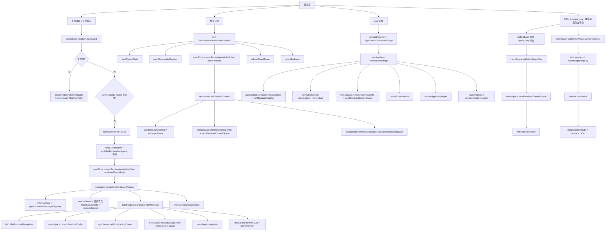

# CLEANUP-V1 P2-A 现状流图

## 当前真实主链总览

## 触发点拆解

### 1. 页面刷新 / 首次进入

- 入口仍在 [beforeEach.ts](/C:/Users/Administrator/Documents/GitHub/G-G-E-commerce/frontend/src/router/guards/beforeEach.ts)。
- 当前 `beforeEach` 已不是早期那种超千行编排器，但 `handleDynamicRoutes()` 仍承担了：
  - 未登录态公开运行时页面的预注册
  - 登录策略判断与 centralized login 跳转
  - 用户信息预热
  - `restoreSession()` 触发的 session + workspace + menu-space 初始化
  - 动态路由注册与首页收口
  - 缺路由时的二次补救刷新

### 2. 登录完成

- 入口在 [shared.ts](/C:/Users/Administrator/Documents/GitHub/G-G-E-commerce/frontend/src/domains/auth/flows/shared.ts) 的 `finalizeAuthenticatedSession()`。
- 当前链路已统一成：
  - `userStore.applySession()`
  - `userStore.restoreSession()`
  - 按需 `refreshUserMenus()`
  - `gotoAfterLogin()`
- 和早期相比，登录链不再直接拼装 `beforeEach` 内部 helper，但仍显式知道“重置路由状态”和“是否刷新菜单”。

### 3. App 切换

- 入口在 header app switcher，最终落到 [app-context runtime](/C:/Users/Administrator/Documents/GitHub/G-G-E-commerce/frontend/src/domains/app-runtime/runtime/app-context.ts) 的 `switchApp()`。
- 当前 `switchApp()` 已是统一入口，但里面仍同时承担：
  - app profile 写入
  - 动态路由 / iframe / worktab 清理
  - menu-space 配置刷新
  - 运行时导航刷新
  - 最终路由跳转

### 4. URL 带 `space_key` 或缺失动态路由补救

- 这两类特殊流量仍由 `beforeEach` 直接处理：
  - `space_key` 分支会先写 `menuSpaceStore`，再直接调 `refreshUserMenus()`
  - `tryRefreshMissingDynamicRoute()` 会推断 appKey 后二次刷新动态菜单
- 它们说明“菜单空间切换”和“缺路由补救”还没完全沉到 runtime 层。

## 当前职责归属

### Session 层

- 实现核心在 [session.ts](/C:/Users/Administrator/Documents/GitHub/G-G-E-commerce/frontend/src/domains/auth/runtime/session.ts)。
- 负责：
  - `auth/me` 用户信息恢复
  - `userStore` 登录态、用户信息与跨账号 worktab 清理
  - `workspaceStore` / `collaborationWorkspaceStore` 当前工作空间归一
  - `menuSpaceStore` 运行时配置刷新与当前空间同步

### App Context 层

- store 在 [context.ts](/C:/Users/Administrator/Documents/GitHub/G-G-E-commerce/frontend/src/domains/app-runtime/context.ts)，运行时切换在 [runtime/app-context.ts](/C:/Users/Administrator/Documents/GitHub/G-G-E-commerce/frontend/src/domains/app-runtime/runtime/app-context.ts)。
- 负责：
  - `runtimeAppKey / managedAppKey`
  - app profile、authMode、feature flags
  - App 切换时的状态写入
- 但当前 `switchApp()` 仍把导航清理与刷新也包进去了。

### Navigation 层

- 主入口在 [navigation.ts](/C:/Users/Administrator/Documents/GitHub/G-G-E-commerce/frontend/src/domains/navigation/runtime/navigation.ts)。
- 负责：
  - manifest 拉取
  - `menuTree -> routes -> homePath`
  - 动态路由注册
  - 公开运行时页面注册
- 但 `buildRegisteredRoutesFromManifest()` 仍会反写 `appContext` 和 `menuSpace`。

### Route Guard 层

- 仍在 [beforeEach.ts](/C:/Users/Administrator/Documents/GitHub/G-G-E-commerce/frontend/src/router/guards/beforeEach.ts)。
- 现在已经收缩成“入口分发 + 异常兜底”，但还保留几段业务性质很强的逻辑：
  - 登录策略预热
  - 用户信息预取
  - `space_key` 驱动的空间切换
  - 缺路由时的菜单刷新补救

## 职责交叉点

### 交叉点 1：Session 层仍直接知道 menu-space 初始化

- 位置：
  - [session.ts](/C:/Users/Administrator/Documents/GitHub/G-G-E-commerce/frontend/src/domains/auth/runtime/session.ts)
- 当前 `refreshSessionContext()` 同时做了：
  - `userStore` 写入
  - `menuSpace.refreshRuntimeConfig()`
  - `menuSpace.syncResolvedCurrentSpace()`
  - `collaborationWorkspace.loadMyCollaborationWorkspaces()`
- 结果：
  - session 层不只恢复“用户上下文”，还在恢复“菜单空间上下文”
  - 用户恢复和导航空间恢复仍然耦合在一个入口里

### 交叉点 2：Navigation 层仍反写 app-context 与 current space

- 位置：
  - [navigation.ts](/C:/Users/Administrator/Documents/GitHub/G-G-E-commerce/frontend/src/domains/navigation/runtime/navigation.ts)
- `buildRegisteredRoutesFromManifest()` 里仍会：
  - `appContextStore.setRuntimeAppContext()`
  - `menuSpaceStore.setActiveSpaceKey()`
- 结果：
  - manifest 解析层仍在决定 app 与 space 的最终状态
  - `app-runtime -> menu-space -> navigation` 的方向还没有完全单向

### 交叉点 3：App 切换入口仍同时拥有导航清理和刷新职责

- 位置：
  - [runtime/app-context.ts](/C:/Users/Administrator/Documents/GitHub/G-G-E-commerce/frontend/src/domains/app-runtime/runtime/app-context.ts)
- `switchApp()` 仍直接做：
  - `worktab.clearAll()`
  - `IframeRouteManager.clear()`
  - `menuStore.removeAllDynamicRoutes()`
  - `refreshUserMenus()`
- 结果：
  - app-runtime 仍知道 navigation 的大量实现细节
  - 组件虽然变薄了，但运行时层本身还是一个“跨域编排器”

### 交叉点 4：Guard 仍保留补救型业务逻辑

- 位置：
  - [beforeEach.ts](/C:/Users/Administrator/Documents/GitHub/G-G-E-commerce/frontend/src/router/guards/beforeEach.ts)
- 典型逻辑：
  - `resolveCentralizedLoginPolicy()` 内部预热 `fetchGetCurrentApp()`
  - `handleDynamicRoutes()` 预取 `fetchGetUserInfo()`
  - `tryRefreshMissingDynamicRoute()` 推断 appKey 后强刷 `refreshUserMenus()`
  - `space_key` 分支直接触发 `syncResolvedCurrentSpace() + refreshUserMenus()`
- 结果：
  - guard 仍不是纯分发器
  - 缺路由、URL 空间切换、登录策略预热都还在 guard 文件里

## `beforeEach.ts` 里还应继续下沉的业务逻辑

以下逻辑虽然比早期少很多，但仍不适合长期放在 guard：

1. `resolveLoginRedirectPolicy()` / `resolveCentralizedLoginPolicy()`
   - 应归到 app-context 或 auth-policy runtime
   - guard 只要拿“当前路由该去本地登录还是中心化登录”的结论

2. `handleDynamicRoutes()` 内的预取用户信息与 `restoreSession()` 闭包
   - 这已经是 session-runtime 的职责
   - guard 不应该显式知道 `fetchGetUserInfo()` 的预热细节

3. `space_key` 分支里的 `setActiveSpaceKey() + syncResolvedCurrentSpace() + refreshUserMenus()`
   - 应下沉到 menu-space runtime
   - guard 只传入“本次导航期望的 spaceKey”

4. `tryRefreshMissingDynamicRoute()`
   - 应变成 navigation-runtime 的内部补救策略
   - guard 只拿“是否已补救成功”的结果

5. `buildCrossDomainAppRedirectTarget()`
   - 更接近 app-runtime 的跨域入口能力
   - 不应长期作为 guard 内部私有规则

## 结论

P2-A 的大方向已经基本实现：

- `session-runtime`
- `app-context-runtime`
- `navigation-runtime`

三层都已经存在，且触发点比早期统一得多。但“当前真实实现”还没有完全收成严格单向链，仍残留三类交叉：

1. `session-runtime` 仍负责 menu-space 初始化
2. `navigation-runtime` 仍反写 app / space 状态
3. `beforeEach` 与 `app-context-runtime` 仍保留补救型业务编排

这意味着当前状态已经从“多入口各自拼链”收敛到了“runtime 三层 + 少量 guard/app-runtime 残留逻辑”，但还没到完全纯净的 dispatcher 形态。

## 推荐后续收口顺序

1. 先把 `beforeEach` 中的登录策略预热、`space_key` 切换、缺路由补救抽成 runtime 接口。
2. 再把 `navigation-runtime.buildRegisteredRoutesFromManifest()` 中的 `appContext` / `menuSpace` 写回移出，改成只返回解析结果。
3. 最后把 `session.refreshSessionContext()` 中的 menu-space 初始化拆出去，让 session 只负责用户与 workspace。
