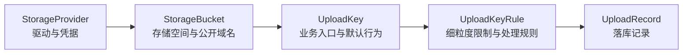
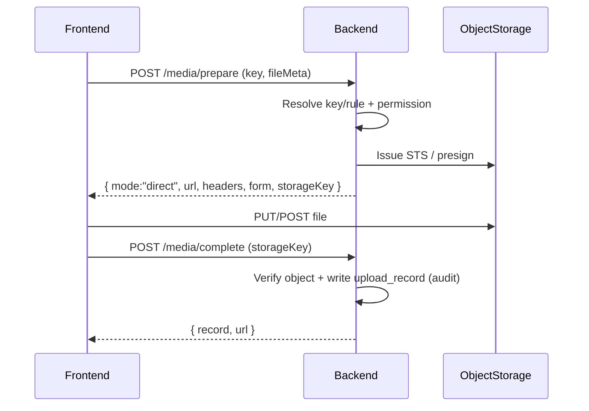
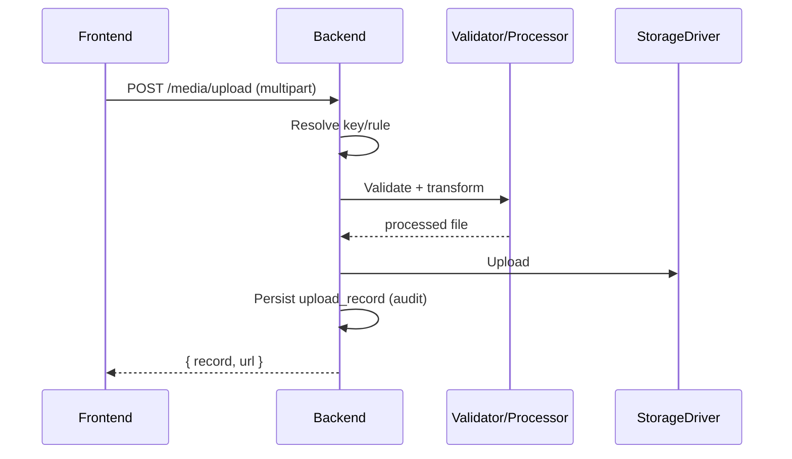
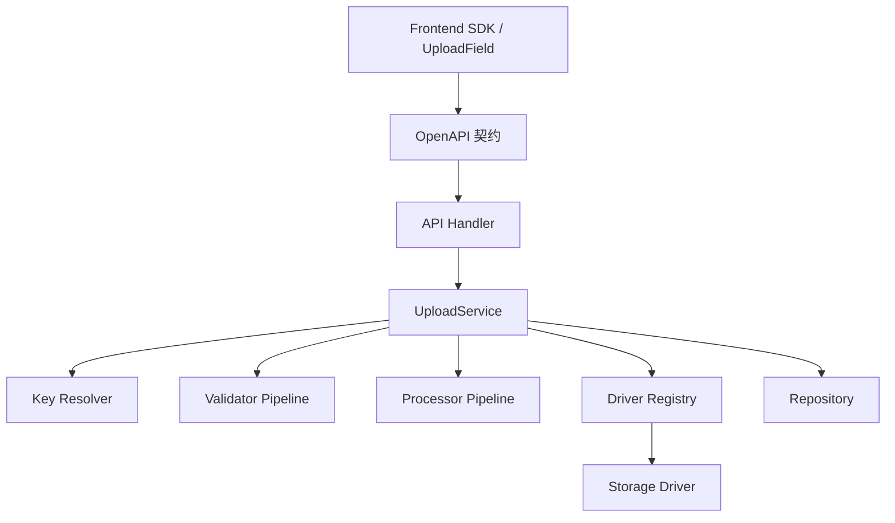
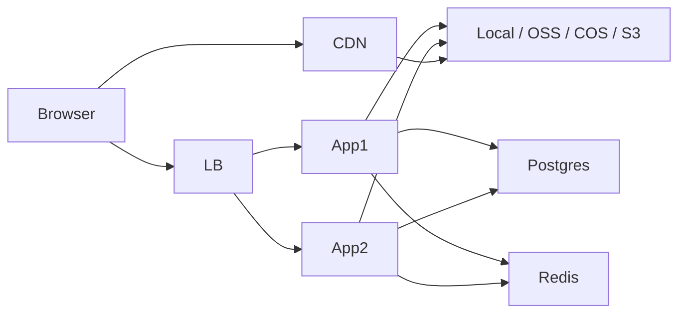

# 上传系统

> 单文档收口。原先的 `spec.md / architecture.md / review.md / adr-summary.md / api-reference.md / frontend-integration.md / extensibility.md / ops-runbook.md / inventory.md / legacy-migration.md / release-plan.md / custom-driver-ftp-example.md / adrs/*` 已合并到本文件，删除其它 md 不会再丢任何上下文。

---

## 1. 当前能力快照

| 维度 | 现状 |
| --- | --- |
| 存储驱动 | `local`（本地盘 relay）、`aliyun_oss`（relay + STS direct） |
| 链路 | relay (`POST /api/v1/media/upload`) + 直传 (`/media/prepare` → 对象存储 → `/media/complete`) |
| 模式开关 | 前端 SDK `MediaUploadOptions.mode = 'auto' \| 'direct' \| 'relay'` |
| 配置面 | `/system/upload-config`：Provider / Bucket / UploadKey 三 tab CRUD + Provider 健康检查 |
| 配置权限 | 单一 `system.upload.config.manage`（已写入 OpenAPI seed） |
| 媒体权限 | `system.media.view`、`system.media.manage` |
| 多租户 | 所有表带 `tenant_id`，仓储默认 `default` |
| 密钥 | 应用层 `AES-256-GCM`，前缀 `secret_cipher_prefix:` 标记 |
| 审计 | `CreateRecord` 写入 `system.upload.record.create` 事件 |

---

## 2. 三层模型与继承

```
StorageProvider          驱动 + 凭据（aliyun_oss 的 endpoint/internal_endpoint/cdn_base_url）
   └─ StorageBucket      存储边界 + 公开域名 + 可见性
        └─ UploadKey     业务入口（如 media.default、avatar.user）
             └─ Rule     mime/size/路径/处理（如 image、file、poster）
                  └─ UploadRecord  落库记录
```

继承顺序：`Provider → Bucket → UploadKey → Rule`，越往后优先级越高。

Key 解析：先 `key.rule`，缺省回退 `UploadKey.default_rule_key`；`key` 不存在则回退系统默认 UploadKey；仍不存在返回 404，不静默兜底。

---

## 3. 架构图

### 三层概念



### 直传时序



### Relay 时序



### 组件依赖



### 部署



---

## 4. ADR 决策汇总

| ID | 决策 | 状态 |
| --- | --- | --- |
| ADR-001 | 采用 `Provider → Bucket → UploadKey → Rule` 四层模型 | Accepted |
| ADR-002 | 动态字段以 JSON 持久化，未来 JSONSchema 驱动校验/表单 | Accepted |
| ADR-003 | 应用层 AES-256-GCM，密文带版本+keyID，预留 KMS | Accepted |
| ADR-004 | 本地盘默认 relay，对象存储无处理需求可 direct | Accepted |
| ADR-005 | 路径模板用有限占位符集合（如 `{yyyy}/{mm}/{dd}`） | Partially Accepted |
| ADR-006 | 校验与轻量处理同步、重处理异步化 | Partially Accepted |
| ADR-007 | 权限键控接口；业务 key 由 capability 白名单控制 | Accepted |
| ADR-008 | 所有持久化实体带 `tenant_id`，查询强制过滤 | Accepted |
| ADR-009 | 保留 `upload_record`，承载列表/删除/审计/回填/统计 | Accepted |
| ADR-010 | 前端 SDK 同时支持 `'key.rule'` 和 `{ key, rule }` | Accepted |

---

## 5. API Reference

### 媒体（业务侧）

| Method | Path | 权限 | 说明 |
| --- | --- | --- | --- |
| POST | `/api/v1/media/prepare` | `system.media.manage` | 直传准备：返回 `{ mode, url, headers, form, storageKey }` |
| POST | `/api/v1/media/complete` | `system.media.manage` | 直传完成：核对对象 + 写 record |
| POST | `/api/v1/media/upload` | `system.media.manage` | Relay 上传 |
| GET  | `/api/v1/media` | `system.media.view` | 媒体列表 |
| DELETE | `/api/v1/media/{id}` | `system.media.manage` | 删除 |

### 配置中心（管理侧）

统一权限：`system.upload.config.manage`

| Method | Path | 说明 |
| --- | --- | --- |
| GET / POST | `/api/v1/storage/providers` | Provider 列表 / 新增 |
| GET / PUT / DELETE | `/api/v1/storage/providers/{id}` | Provider CRUD |
| POST | `/api/v1/storage/providers/{id}/test` | 健康检查 |
| GET / POST | `/api/v1/storage/buckets` | Bucket 列表 / 新增 |
| GET / PUT / DELETE | `/api/v1/storage/buckets/{id}` | Bucket CRUD |
| GET / POST | `/api/v1/upload/keys` | UploadKey 列表 / 新增 |
| GET / PUT / DELETE | `/api/v1/upload/keys/{id}` | UploadKey CRUD |
| GET / POST | `/api/v1/upload/keys/{id}/rules` | Rule 列表 / 新增 |
| PUT / DELETE | `/api/v1/upload/rules/{ruleId}` | Rule 编辑 / 删除 |

### 生成

- OpenAPI 源：`backend/api/openapi/`
- 后端：`backend/api/gen/`
- 前端：`frontend/src/api/v5/`

---

## 6. 前端集成

### 入口

- `frontend/src/domains/upload/api.ts`
  - `uploadMediaWithPrepare(file, target)`：默认入口，按服务端返回切 direct/relay
  - `uploadMedia(file)`：等价于上面 + 默认 target
  - `prepareMediaUpload` / `completeMediaUpload`：低阶
  - `listMedia` / `deleteMedia`
- `frontend/src/domains/upload/use-upload.ts`
  - `useUpload().submit(file, options)`：组合式封装
- `frontend/src/components/core/forms/art-wang-editor/index.vue`：富文本图片走统一 SDK
- 配置后台：`frontend/src/views/system/upload-config/index.vue`
- 配置 API 客户端：`frontend/src/domains/upload-config/api.ts`

### 模式开关

```ts
import { useUpload } from '@/domains/upload/use-upload'
const { submit } = useUpload()

// 自动（默认）：服务端给 direct 就直传，否则中转
await submit(file, { key: 'media.default', rule: 'image' })

// 强制中转：跳过 prepare，少一次 RTT，常用于禁用直传或回退
await submit(file, { key: 'media.default', mode: 'relay' })

// 强制直传：服务端给 relay 时抛错而不是静默回退，便于排查 STS 链路
await submit(file, { key: 'media.default', mode: 'direct' })
```

### 请求上下文

SDK 自动附带：`Authorization`、`X-Auth-Workspace-Id`、`X-Collaboration-Workspace-Id`。

### Key 语法

- 扁平：`upload('media.default.image', file)`
- 对象：`upload({ key: 'media.default', rule: 'image', file })`

---

## 7. 扩展 Driver / Processor

### Driver 职责边界

**只解决**「如何把对象写入目标存储」。**不负责**业务权限、UploadKey/Rule 解析、业务表写入。

最少接口：`Name / Capabilities / HealthCheck / Upload / Delete / Prepare(可选) / Complete(可选)`

### 落位

- Driver：`backend/internal/modules/system/upload/driver/*`
- Processor：`backend/internal/modules/system/upload/processor/*`
- Registry：`backend/internal/modules/system/upload/registry.go`
- 模板：`backend/internal/modules/system/upload/examples/custom_driver_template.go`
- Contract harness：`backend/internal/modules/system/upload/uploadtest/contract.go`
- Harness 自检：`backend/internal/modules/system/upload/contract_harness_test.go`

### 接入步骤

1. 独立包内实现，保留 `Name / Capabilities / HealthCheck / Upload / Delete / PrepareDirectUpload`
2. 用 `upload.DriverFactoryInput` 解析 provider/bucket 配置，**不读业务上下文**
3. 模块初始化时通过 `DriverRegistry.Register` 显式注册（**禁止运行期动态加载**）
4. 用 `uploadtest.RunDriverContractSuite` 跑契约：capability 与 relay/direct/delete 行为一致

### 安全硬约束

- 编译期注册为唯一入口；禁止运行期动态加载
- 禁止 driver 内自行决定租户权限、Key 可见性、规则合并
- 禁止越过 `storageKey` 边界访问 bucket 之外路径；本地缓存/临时文件必须在显式配置目录
- 所有 I/O 受 `context.Context` 控制，超时/取消/重试可配置
- 凭据只来自 provider/bucket 配置，日志脱敏，不得回写原始密钥
- 不得把内网 endpoint、源站鉴权头或临时凭证泄露给前端返回值

### Aliyun OSS 三类域名

`backend/internal/modules/system/upload/aliyun_endpoints.go` 已固化：

- `endpoint`：外网 API 域名，默认服务端直连
- `internal_endpoint`：内网 API 域名，仅同地域内网部署启用
- `cdn_base_url`：对外回填给前端/业务表的公开访问域名

常见错位：

- 把 `internal_endpoint` 返回前端 → 浏览器不可达，预览 404/超时
- 把 `cdn_base_url` 当 SDK endpoint → 签名/上传目标错
- `endpoint` 与 bucket 地域不匹配 → 鉴权失败、301/307、对象不存在

### Processor 约束

- 输入是标准化文件上下文，输出修改后的文件或附加元数据
- 不直接依赖业务表
- 不写死租户和权限逻辑
- 错误返回标准化错误码
- 外部资源调用必须可配置超时

### 占位例：FTP / SFTP relay driver

只示意结构，不参与默认编译，不建议直接用于生产。

```go
package myftp

import (
    "context"
    "github.com/maben/backend/internal/modules/system/upload"
)

type Driver struct{}

func (d *Driver) Name() string { return "ftp" }

func (d *Driver) Capabilities() upload.DriverCapabilities {
    return upload.DriverCapabilities{Relay: true, Delete: true}
}

func (d *Driver) HealthCheck(context.Context) error { return nil }

func (d *Driver) Upload(context.Context, upload.UploadRequest) (*upload.UploadResult, error) {
    // 1. 校验 storageKey 前缀
    // 2. 建立 FTP/SFTP 连接
    // 3. 临时文件名上传，成功后 rename
    // 4. 返回对外 URL
    return nil, nil
}

func (d *Driver) Delete(context.Context, upload.DeleteRequest) error { return nil }

func (d *Driver) PrepareDirectUpload(context.Context, upload.DirectUploadRequest) (*upload.DirectUploadResult, error) {
    return nil, &upload.DriverError{
        Code:      upload.DriverErrorCodeCapabilityUnsupported,
        Driver:    d.Name(),
        Operation: "prepare_direct_upload",
        Message:   "capability is not supported by this driver",
    }
}
```

接入前至少补：超时/重试/连接池策略、`storageKey` 边界校验、凭证脱敏与日志约束、契约测试。

---

## 8. 运维

### 配置项

```
upload.local_root
upload.public_base_url
upload.default_tenant_id
upload.default_provider_key
upload.default_bucket_key
upload.default_upload_key
upload.default_rule_key
upload.max_file_size_bytes
upload.secret_master_keys
upload.secret_current_key_id
upload.secret_cache_ttl_seconds
```

### 热更新策略

- 当前基线：启动时加载、进程内只读，**不支持运行期热更新**
- 变更走「改配置 → 发布新实例 → 健康检查 → 切流 → 下线旧实例」
- `upload.local_root`、`upload.public_base_url`、`upload.secret_*` 一律视为需要重启生效
- 后续接配置中心：仅允许对非密钥、非存储根目录类配置做灰度热更新

### 部署步骤

1. 执行数据库迁移
2. 确认 `data/uploads` 或配置目录可写
3. 执行 `backend/cmd/migrate`，确保默认 provider/bucket/key/rule seed 到位
4. 启动并验证 `/uploads` 静态访问

### 故障排查

| 现象 | 排查 |
| --- | --- |
| 401 | token / 工作区上下文头 |
| 403 | `system.media.manage`（业务）或 `system.upload.config.manage`（配置） |
| 500 | 本地目录权限 / DB 连接 / `upload.*` 配置 |
| 文件已写但列表为空 | `upload_records` 写入与 `tenant_id` |
| 直传成功但预览 404 | OSS 三类域名错位（参见 §7） |

### 日志与指标

记录字段：`tenant_id / provider_key / bucket_key / upload_key / rule_key / size / duration`

后续补：成功失败计数器、上传耗时直方图、文件大小分布。

### 密钥轮换 SOP

1. 增加新主密钥并设置新 `current_key_id`
2. 保留旧主密钥用于读取历史密文
3. 验证新写入密文使用新 key id
4. 逐步重写或自然替换旧密文
5. 最后移除旧主密钥

### 密钥泄露应急

1. 冻结泄露 `key_id`，停止以该 key 写入新密文
2. 生成新主密钥，更新 `upload.secret_master_keys` 与 `current_key_id`，滚动发布
3. 抽样验证：新写入密文前缀已切换，新实例可解密历史密文
4. 若云厂商凭据受影响，立刻轮换 AK/SK，并通过管理接口或 seed 回写新密文
5. 对受影响时间窗内的上传/删除/配置变更补做审计排查
6. 历史密文全部迁移或自然淘汰后再移除旧主密钥

### KMS 预留方向

- 上层仓储仅依赖 `SecretCipher` 接口
- 密文格式继续保留「版本 + key_id」语义
- 配置层只新增 secret driver 选择，不动 Provider/Bucket/Key/Rule 表结构
- 预留：`aes_gcm`（当前）、`aws_kms`、`aliyun_kms`

---

## 9. 错误码

契约稳定，前端按错误码映射文案：

```
upload.key_not_found
upload.rule_not_found
upload.mime_not_allowed
upload.file_too_large
upload.driver_not_supported
upload.driver_unavailable
```

---

## 10. 迁移与盘点

### 仓库内已收敛

| 入口 | 现状 |
| --- | --- |
| `POST /api/v1/media/upload` | `backend/internal/api/handlers/media.go`，挂载于 `router.go` |
| `frontend/src/domains/upload/api.ts` | 统一收敛 |
| `frontend/src/domains/upload/use-upload.ts` | 组合式封装 `submit / fetchList / remove` |
| `art-wang-editor/index.vue` | WangEditor 走 `uploadMediaWithPrepare` |
| `views/message/modules/message-dispatch-console.vue` | 通过 `ArtWangEditor` 间接走新链路 |
| `views/message/modules/message-template-console.vue` | 同上 |

仓库内未发现仍直接调用 `/api/common/upload`、`/api/media/upload`、minio SDK 的前端代码。

### 老 endpoint → 新 SDK

- 旧富文本上传 → `uploadMediaWithPrepare(file)` / `useUpload().submit(file)`
- 旧媒体列表 → `listMedia()`
- 旧媒体删除 → `deleteMedia(id)`

迁移顺序：直接请求旧 endpoint 的 → 收敛到 `domains/upload/api.ts` → 表单/组件统一 `useUpload()` → 富文本走 `ArtWangEditor`。

### 老数据回填 upload_record

仅对仍需后台可见的历史文件回填，最少字段：`tenant_id / original_filename / stored_filename / storage_key / url / mime_type / size`。

### 老路径兼容

- 旧 URL 仍被外部页面引用 → 保留旧静态目录映射
- 迁移到新目录 → 保留 rewrite 或软链接
- 当前基线策略：已存在 public URL **不改写历史路径**，新上传用新模板
- 切 CDN 域名前必须评估缓存失效与回源目录兼容

### Deprecation 时间线

1. 发布新 SDK 与迁移清单
2. 业务调用切流到 `uploadMediaWithPrepare` / `useUpload`
3. CHANGELOG 与内部通知标记旧调用废弃
4. 观察至少 2 个版本周期，确认无回流
5. 删除旧入口或保留只读兼容层

---

## 11. 发布检查

```bash
go test ./...
pnpm run gen:api
pnpm run build
# 迁移执行成功
# 默认 seed 生效
# /uploads 静态路径可访问
```

### 回滚预案

- 回滚代码版本
- 执行迁移 Down 前确认无新表依赖数据
- 保留上传目录与记录表快照
- 演练至少覆盖：仅代码回滚 / 代码+配置回滚（旧实例可读新密文） / 结构回滚

### 上线 48h 盯盘

观察上传成功率、5xx 与权限错误、磁盘空间增长、抽样验证媒体列表与删除。

---

## 12. 当前结论

- **可上线基线**：本地盘 relay + Aliyun OSS（含 STS direct）已闭环
- **配置面闭环**：Provider / Bucket / UploadKey 三 tab 管理页 + Provider 健康检查
- **直传开关**：前端 `mode = 'auto' | 'direct' | 'relay'` 可强制
- **审计闭环**：`CreateRecord` 落库即写 `system.upload.record.create` 事件
- **未完成**（保留扩展空间）：multipart 分片、Rule 后台 UI、运营统计页、E2E、JSONSchema 表单

